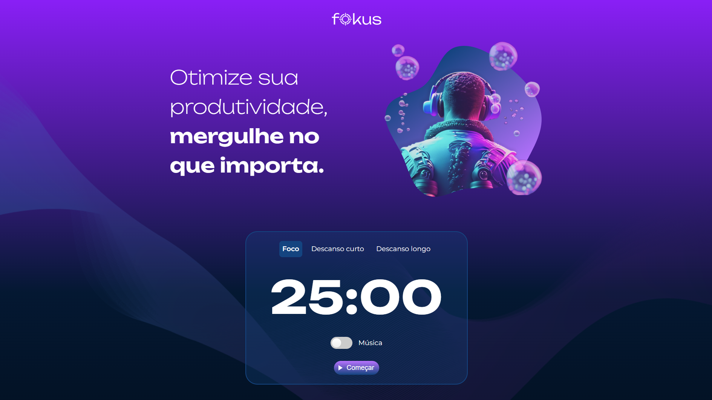

# FOKUS

> O projeto Fokus consiste na ideia de um site para ajudar pessoas a se manterem focadas nas tarefas que desejam fazer.

## ✅ Status do projeto

Este projeto está finalizado e não há planos para novas funcionalidades ou atualizações futuras.

## 🔨 Funcionalidades

- O site oferece um cronômetro diferente dependendo do se deseja fazer, sendo elas um tempo para se concentrar, descansar por um breve período ou um longo descanso.
- O usuário pode ouvir uma música relaxante a qualquer momento.
- Fornece opção para iniciar o cronômetro, pausar e finalizar o mesmo.
- Possui uma lista onde o usuário pode inserir livremente suas tarefas.
- Oferece opção para cancelar a digitação da tarefa para caso o usuário se arrependa da mesma.
- O usuário pode editar, deletar tarefas já concluídas e deletar todas as tarefas inseridas na lista.

## 💻 Tecnologias

- `JavaScript`
- `Git/GitHub`
- `HTML`
- `CSS`

## 📝 Contribuição

Contribuições são sempre bem-vindas! Sinta-se à vontade para abrir uma issue ou um pull request se encontrar algum problema ou tiver uma sugestão.

1. Faça um **fork** do projeto.
2. Crie um **branch** para sua feature (`git checkout -b feature/nome-da-feature`).
3. Faça o **commit** das suas mudanças (`git commit -m 'Adicionei uma nova feature!'`).
4. Faça o **push** para o branch (`git push origin feature/nome-da-feature`).
5. Abra um **Pull Request**.

## 📁 Como utlizar

Para começar você deve baixar o projeto, após isso você poderá abrir o mesmo utilzando o Visual Studio Code. Siga os seguintes passos:

- No canto superior esquerdo clique em **File** > **Open Folder**
- Procure o local onde o projeto está e o selecione (Caso o projeto seja baixado via zip, é necessário extraí-lo antes de procurá-lo)
- Por fim clique em OK

Após a execução dos passos anteriores o projeto pode ser executado via Live Server.
